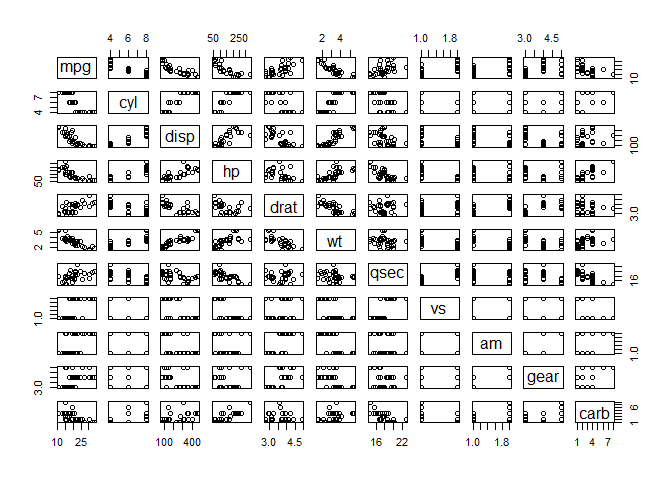
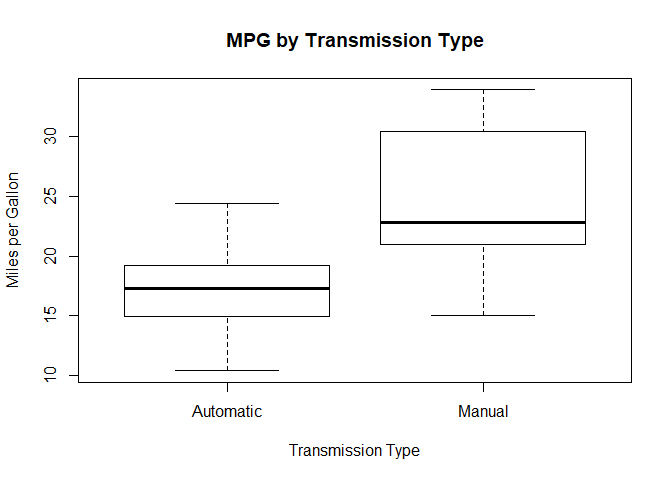
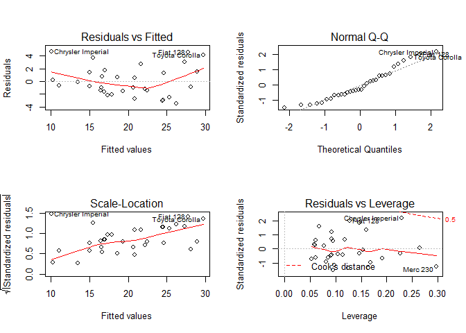

### Executive Summary

The objective of this project is to analyze the relationship between a
set of variables to miles per gallon (MPG) using the 'mtcars' data. In
particular, we are most interested to learn:

1.  Is an automatic or manual transmission better for MPG?
2.  Quantify the MPG difference between automatic and manual
    transmissions.

According to the final model, manual transmission car is better for MPG
and yields 2.93 more MPG than automatic transmission car when holding
car's weight and 1/4 mile time constant.

### Exploratory Data Analysis

    head(mtcars)

    ##                    mpg cyl disp  hp drat    wt  qsec vs am gear carb
    ## Mazda RX4         21.0   6  160 110 3.90 2.620 16.46  0  1    4    4
    ## Mazda RX4 Wag     21.0   6  160 110 3.90 2.875 17.02  0  1    4    4
    ## Datsun 710        22.8   4  108  93 3.85 2.320 18.61  1  1    4    1
    ## Hornet 4 Drive    21.4   6  258 110 3.08 3.215 19.44  1  0    3    1
    ## Hornet Sportabout 18.7   8  360 175 3.15 3.440 17.02  0  0    3    2
    ## Valiant           18.1   6  225 105 2.76 3.460 20.22  1  0    3    1

    dim(mtcars)

    ## [1] 32 11

    str(mtcars)

    ## 'data.frame':    32 obs. of  11 variables:
    ##  $ mpg : num  21 21 22.8 21.4 18.7 18.1 14.3 24.4 22.8 19.2 ...
    ##  $ cyl : num  6 6 4 6 8 6 8 4 4 6 ...
    ##  $ disp: num  160 160 108 258 360 ...
    ##  $ hp  : num  110 110 93 110 175 105 245 62 95 123 ...
    ##  $ drat: num  3.9 3.9 3.85 3.08 3.15 2.76 3.21 3.69 3.92 3.92 ...
    ##  $ wt  : num  2.62 2.88 2.32 3.21 3.44 ...
    ##  $ qsec: num  16.5 17 18.6 19.4 17 ...
    ##  $ vs  : num  0 0 1 1 0 1 0 1 1 1 ...
    ##  $ am  : num  1 1 1 0 0 0 0 0 0 0 ...
    ##  $ gear: num  4 4 4 3 3 3 3 4 4 4 ...
    ##  $ carb: num  4 4 1 1 2 1 4 2 2 4 ...

    mtcars$am <- factor(mtcars$am)
    mtcars$vs <- factor(mtcars$vs)

    plot(mtcars)

    boxplot(mtcars$mpg~mtcars$am,main='MPG by Transmission Type',xlab='Transmission Type',
            ylab='Miles per Gallon',names=c('Automatic','Manual'))

From the scatterplots, we can see some variables are correlated with
mpg. Also, the boxplot shows that the miles per gallon is different
between manual transmission and automatic transmission car. To verify if
the difference is significant and quantify the difference, we perform
regression analysis.

### Regression Analysis

#### Simple Linear Regression

    fit <- lm(mpg~am,data=mtcars)
    summary(fit)$coef

    ##              Estimate Std. Error   t value     Pr(>|t|)
    ## (Intercept) 17.147368   1.124603 15.247492 1.133983e-15
    ## am1          7.244939   1.764422  4.106127 2.850207e-04

The simple linear regression model result shows that on average, the
manual transmission car yields 7.24 more miles per gallon than automatic
transmission car. However, through the above scatterplot, we know other
variables are correlated with mpg as well. Therefore, we fit multiple
regression model and use stepwise selection to decide our final model.

#### Multiple Regression

    fitstep <- step(lm(mpg~.,data=mtcars),direction='both',trace = 0)
    summary(fitstep)

    ## 
    ## Call:
    ## lm(formula = mpg ~ wt + qsec + am, data = mtcars)
    ## 
    ## Residuals:
    ##     Min      1Q  Median      3Q     Max 
    ## -3.4811 -1.5555 -0.7257  1.4110  4.6610 
    ## 
    ## Coefficients:
    ##             Estimate Std. Error t value Pr(>|t|)    
    ## (Intercept)   9.6178     6.9596   1.382 0.177915    
    ## wt           -3.9165     0.7112  -5.507 6.95e-06 ***
    ## qsec          1.2259     0.2887   4.247 0.000216 ***
    ## am1           2.9358     1.4109   2.081 0.046716 *  
    ## ---
    ## Signif. codes:  0 '***' 0.001 '**' 0.01 '*' 0.05 '.' 0.1 ' ' 1
    ## 
    ## Residual standard error: 2.459 on 28 degrees of freedom
    ## Multiple R-squared:  0.8497, Adjusted R-squared:  0.8336 
    ## F-statistic: 52.75 on 3 and 28 DF,  p-value: 1.21e-11

    anova(fit,fitstep)

    ## Analysis of Variance Table
    ## 
    ## Model 1: mpg ~ am
    ## Model 2: mpg ~ wt + qsec + am
    ##   Res.Df    RSS Df Sum of Sq      F   Pr(>F)    
    ## 1     30 720.90                                 
    ## 2     28 169.29  2    551.61 45.618 1.55e-09 ***
    ## ---
    ## Signif. codes:  0 '***' 0.001 '**' 0.01 '*' 0.05 '.' 0.1 ' ' 1

The final model we decide to use include variables weight, transmission
type and 1/4 mile time. We also perform ANOVA test to compare with the
smiple linear regression model and confirm that adding these varaibles
is significant. Also, the R^2 is 85% which tells us 85% of the variation
in this model could be explained by the three selected variables.

From the multiple regression model, we conclude that manual transmission
car is better for MPG and yields 2.93 more MPG than automatic
transmission car when holding car's weight and 1/4 mile time constant.

#### Residual Plot Diagnostics

    par(mfrow=c(2,2))
    plot(fitstep)

The residual and fitted plot show that the variance are center around
zero which means the variance are the same. Also, the normal qq plot
shows the normality assumption hold in this model. Hence, we can say
that the model is a good fit.
